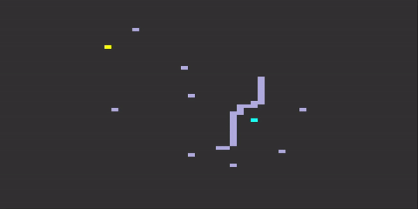
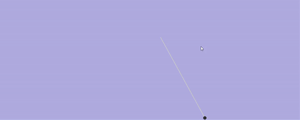

| GJK Collision Detection | A* Shortest Path | Projectile Motion |
| ------------- |:-------------:| ------------- |
|  |  | 

## GJK Collision Detection
Interactive tool for visualizing the Gilbert-Johnson-Keerthi (distance) 
algorithm for collision detection. 

## A* Shortest Path
Interactive tool for visualizing the A* Shortest Path Finding Algorithm, 
which is an informed search algorithm that determines the shortest path 
between nodes.

## Projectile Motion
Interactive tool for visualizing 2D Projectile Motion with zero air 
resistance and constant acceleration in the vertical direction.

## Dependency 
Pygame
